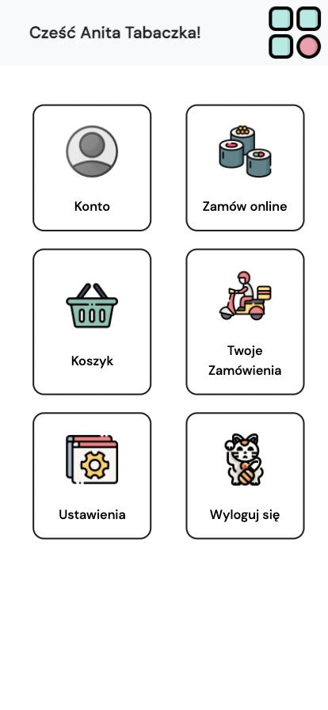
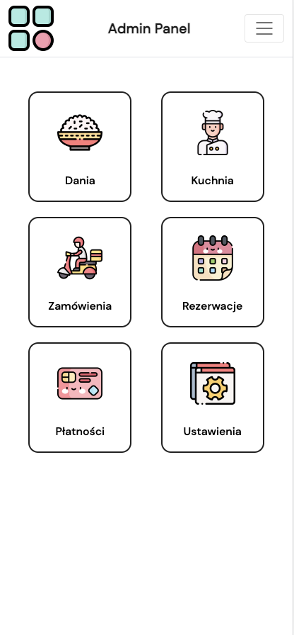

to run:  
- npm install
- npm run serve
 
resources:  
- Icons from: https://www.flaticon.com  
- Photos from: https://unsplash.com/ (Free to use under the Unsplash License)
  
Bootstrap 5 documentation:  

https://getbootstrap.com/docs/5.0/getting-started/introduction/
   
<h4 align="center">User dashboard:</h4>

   

<h4 align="center">Admin dashboard:</h4>

